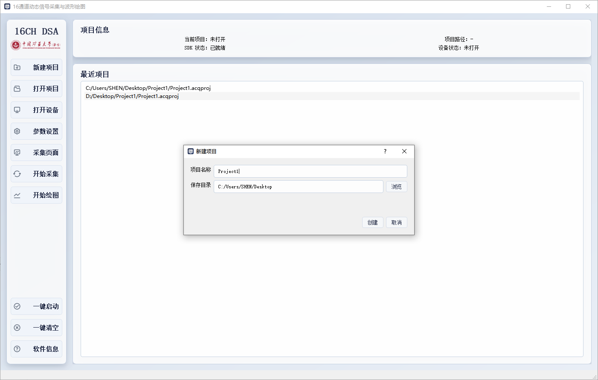
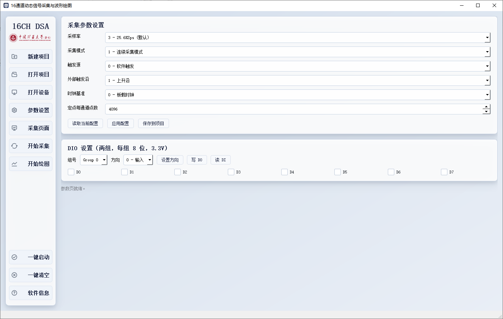
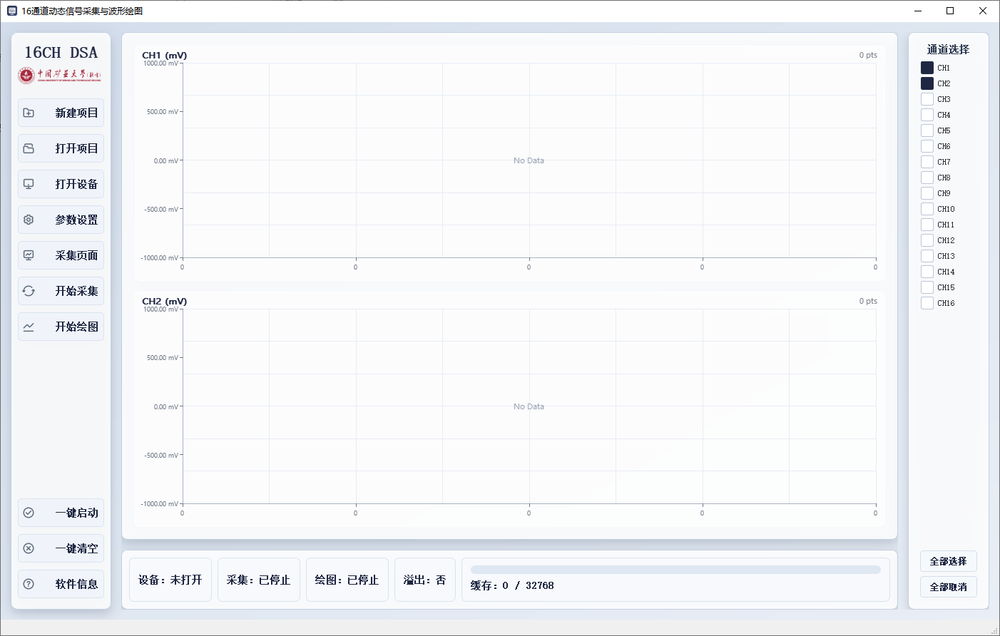
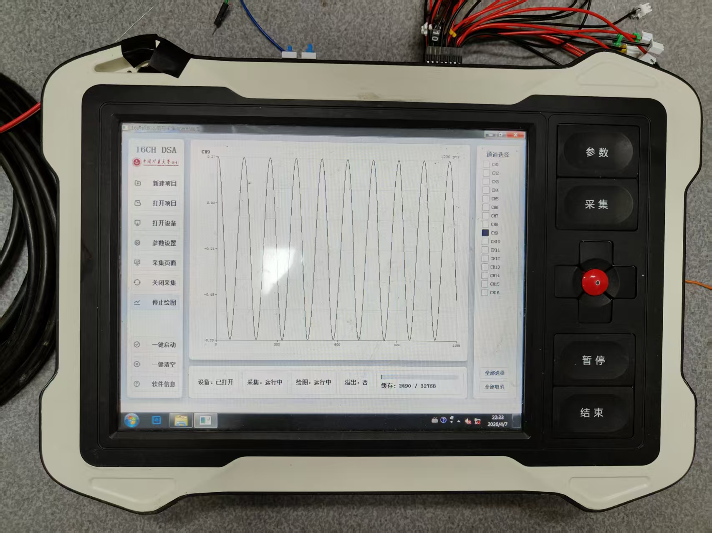
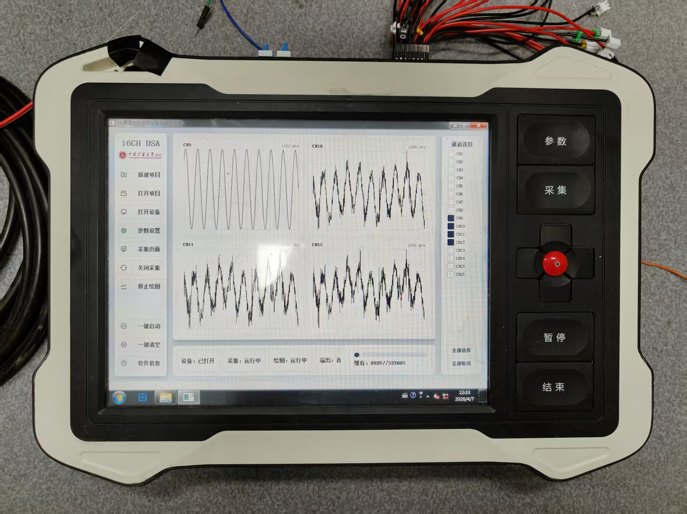
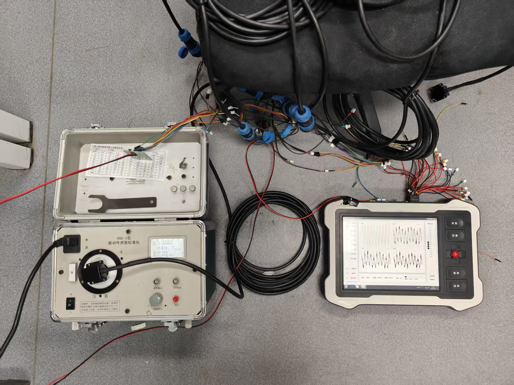

# 16 通道动态信号采集与波形显示软件

一套面向 16 通道数据采集、实时波形观察、项目化管理与历史数据读取的桌面软件。  
软件采用 Qt Widgets 构建，适合本地采集、现场观察、参数配置、数据留存与后续离线分析。

## ✨ 软件亮点

- 🗂️ 支持新建、打开和管理采集项目，自动维护项目配置与数据目录
- ⚙️ 支持采样率、采集模式、触发方式、时钟基准和定点点数等参数设置
- 📡 支持设备打开、开始采集、停止采集、实时状态监控
- 📈 支持 16 通道波形网格化显示，按需勾选通道查看
- 🚦 支持缓存点数、缓存占用、溢出状态的实时提示
- 🔌 支持两组 8 位 DIO 的方向设置、DO 写入和 DI 读取
- 💾 采集数据自动落盘，便于后续分析、回放和归档
- 🚀 支持一键启动、一键清空，适合现场快速操作
- 🧪 支持 mock 模式，在没有真实设备时也能联调界面与流程

## 🖼️ 界面预览

下面的截图展示了软件从项目管理、参数配置到实时波形显示的主要界面，以及在实机上的运行效果。

### 首页与项目管理

项目首页用于查看当前项目、最近项目和设备状态，也支持快速新建项目，便于现场快速建立采集任务。



### 参数配置页

参数页集中管理采样率、采集模式、触发源、外部触发沿、时钟基准和定点点数，同时支持 DIO 方向设置、DO 写入和 DI 读取。



### 采集页与状态栏

采集页支持通道勾选、绘图启动/停止、缓存进度观察和采集状态监控。少量通道时显示完整坐标轴，便于直接观察幅值与点数变化。



### 单通道绘图效果

单通道模式下，波形区域会尽量放大，横纵坐标会详细显示数值单位，适合关注单一路信号的幅值、周期与细节变化。



### 四通道绘图效果

多通道模式下，界面会自动切换为网格布局，在保持整体可视性的同时兼顾多个通道的同步观察。



### 实机测试场景

下图展示了软件运行在16通道采集板卡上时，与MEMS数字检波器、振动传感器校准设备联调时的现场测试状态，已用于实机采集验证。



## 🧭 主要功能

### 1. 项目管理

- 新建项目后会自动生成项目目录与项目文件
- 项目文件使用 `.acqproj` 格式保存参数与路径信息
- 软件支持最近项目列表，便于快速回到上一次工作现场
- 可直接通过命令行打开项目文件

示例：

```bash
Dsa16ChAcquisition.exe D:\Projects\Demo\Demo.acqproj
```

### 2. 参数配置

- 采样率可选 204.8KSps、102.4KSps、51.2KSps、25.6KSps、12.8KSps、6.4KSps
- 采集模式支持单次定点、连续采集、连续定点
- 支持软件触发与外部触发
- 支持板载时钟与外部时钟
- 参数既可以直接应用，也可以保存到项目中

### 3. 实时采集与波形显示

- 采集启动后会持续读取 16 通道数据
- 软件会根据缓存水位自动调整读取与绘图节奏，尽量降低卡顿和积压
- 波形区域支持按通道数量自适应布局
- 少量通道时显示更完整的坐标轴，多通道时优先保证整体可视性
- 当缓存接近上限时，界面会给出更明显的预警

### 4. 数据保存

- 当前版本默认将采集数据写入 `session_*.bin` 文件
- 连续采集时会自动分卷，避免单个文件过大
- 软件仍兼容旧版 `ch*.bin` 数据文件读取
- 旧版地震采集格式 `Seismic_data_*.bin` 也提供了独立 MATLAB 读取脚本

## 🧪 Mock 模式

如果当前只想联调界面或演示流程，可以使用 mock 模式启动软件。  
此时软件会生成模拟波形数据，便于验证页面联动、绘图刷新和文件写入流程。

## 🧰 MATLAB 读取数据文件

仓库内已经附带两个 MATLAB 脚本：

- `read_dsa_data_and_plot.m`
  用于读取当前主格式数据，支持：
  - `session_*.bin`
  - `session_*_partNNN.bin`
  - 旧版 `ch*.bin`
- `read_seismic_data_and_plot.m`
  用于读取旧版地震采集格式 `Seismic_data_*.bin`

## 🧩 资源与附带代码说明

除了主程序本体，仓库里还附带了一些直接服务于界面和数据处理的资源文件：

- `resources/styles/main.qss`
  用于统一软件界面样式，包括侧边栏、卡片、按钮、缓冲进度条和波形页面的视觉风格
- `resources/icons/app_icon.png`
  用于程序运行时窗口图标和任务栏图标
- `resources/icons/app_icon.ico`
  用于 Windows 可执行文件图标
- `resources/resources.qrc`
  Qt 资源索引文件，用来把图标、样式、logo 等资源打包进程序
- `read_dsa_data_and_plot.m`
  当前主格式数据的 MATLAB 读取与绘图脚本
- `read_seismic_data_and_plot.m`
  旧版地震采集数据的 MATLAB 读取与绘图脚本
- `readme-image/`
  README 配图目录，包含界面截图、实机照片和测试场景图

### MATLAB 脚本适合做什么

- 快速检查采集文件是否正常
- 按通道查看历史波形尾部数据
- 对旧格式和当前格式做兼容读取
- 作为后续频谱分析、滤波、统计处理的输入脚本模板

## 🚀 典型使用流程

1. 新建或打开项目
2. 打开设备
3. 进入参数设置页调整采集参数
4. 开始采集，观察缓存与溢出状态
5. 开始绘图，勾选需要关注的通道
6. 结束采集后使用 MATLAB 脚本进行离线分析

## 💡 适用场景

- 振动信号采集
- 结构响应监测
- 多通道动态信号记录
- 地震/波形类数据现场采集与快速查看
- 采集数据的项目化留存与后处理

## 📌 说明

- 软件重点面向“现场采集 + 本地观察 + 文件留存 + MATLAB 后处理”的完整流程
- 当前仓库以主工程 `src/` 版本为准
- 历史数据脚本仍保留对旧格式文件的兼容支持，方便已有数据继续使用
